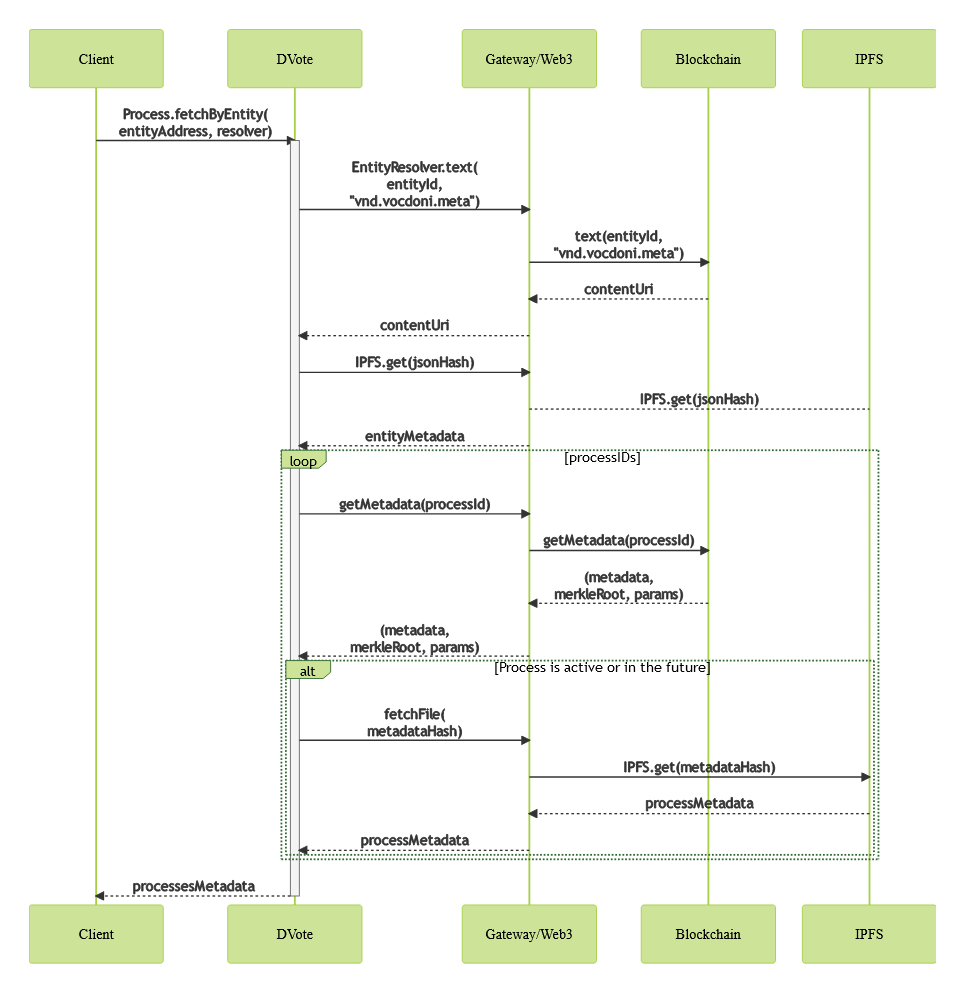

# Component Interaction

Traditional systems like APIs present simple scenarios, in which a centralized service define how data should be encoded. However, decentralized ecosystems like a distributed voting system need much stronger work on defining every interaction between any two peers on the network.

### Prior to voting 

#### Overview 

Before a voting process can take place, the following four general steps must occur:

1. Vocdoni deploys the [smart contracts](https://github.com/vocdoni/dvote-solidity#contracts) to Ethereum
2. The **organizer** registers an [Entity](https://docs.vocdoni.io/architecture/smart-contracts/entity-resolver) to the blockchain
   * The metadata of the entity is pinned on IPFS
   * The reference is declared on the ENS resolver of the entity
3. A public key is registered for each user
   * _Either_:
     * The **voter** creates a self-sovereign identity and registers to an organization with their public key
     * The **organizer** keeps a list of registered public keys of eligible voters
   * _Or_:
     * The **organizer** creates a spreadsheet containing private information of each eligible voter. Each voter's public key for a specific voting process is derived from their private information.
4. The **organizer** published a census Merkle Tree containing all voters' public keys

#### Initial Gateway discovery 

The client wants to get initial connectivity with the available gateways.

1. Using a well-known Ethereum Gateway, we query for an initial boot node on the ENS Resolver. The following is defined:
   * Well-known Ethereum blockchain gateways
   * Entity Resolver contract address
   * Vocdoni's Entity ID
2. From one of the boot nodes, we get a list of Gateways provided by Vocdoni

.png>)

Eventually:

* One of Vocdoni's Gateways is used to query the ENS resolver of a certain Entity

#### Set Entity metadata 

An Entity starts existing at the moment it has certain metadata stored on the [Entity Resolver](https://docs.vocdoni.io/architecture/smart-contracts/entity-resolver.html#entityresolver) smart contract.

.png>)

**Used schemas:**

* [Entity metadata](https://docs.vocdoni.io/architecture/data-schemes/entity-metadata)

### Voting 

#### Overview 

The voting process as a whole is as follows:

1. The **organizer** creates a voting process
   * Select the voter census or voter csv to use
   * Get the census Merkle Root
   * Pin the Merkle Tree on IPFS or similar
   * Pin the [Process Metadata](https://docs.vocdoni.io/architecture/data-schemes/process) on IPFS
   * Send a transaction to the process smart contract, including [Content URI](https://docs.vocdoni.io/architecture/protocol/data-origins.html#content-uri)s pointing to the [Process Metadata](https://docs.vocdoni.io/architecture/data-schemes/process) and the [Census Merkle Tree](https://docs.vocdoni.io/architecture/census/census-overview.html), along with the rest of parameters
   * Update the list of voting processes on the [ENS Resolver](https://docs.vocdoni.io/architecture/smart-contracts/entity-resolver.html#entity-resolver) contract for the entity
2. The **voter** fetches the active processes for an **Entity**, or is sent a link directly to a process
   * Read the description and review the voting options
3. The **voter** verifies that they belong in the census:
   * _Either_:
     * Decrypt their self-managed key and check its inclusion in the census
   * _Or_:
     * Enter their private information to the client, which generates their ephemeral key pair for this process, and check that key's inclusion in the census
4. The **voter** casts a vote
   * The client generates a proof that the voter's key belongs in the census Merkle Tree
   * The client computes the user's nullifier for the vote
   * The client generates the [Vote Package](https://docs.vocdoni.io/architecture/smart-contracts/process.html#vote-package-zk-snarks) with the election choices
   * _If the process is encrypted_:
     * The client fetches the encryption public keys from the **Gateway**
     * The client encrypts the [Vote Package](https://docs.vocdoni.io/architecture/smart-contracts/process.html#vote-package-zk-snarks) with the public keys of the voting process
   * _If the process is anonymous_:
     * The client fetches the proving and verification keys and then generates the **Zero-Knowledge Proof**
     * The ZK Proof proves that:
       * The voter knows a private key, whose public key belongs to the census
       * The provided nullifier matches the current process ID and the user's private key
   * The client generates the [Vote Envelope](https://docs.vocdoni.io/architecture/data-schemes/process.html#vote-envelope-zk-snarks) containing the Vote Package
   * The client selects a **Gateway** among the available ones and submits the [Vote Envelope](https://docs.vocdoni.io/architecture/data-schemes/process.html#vote-envelope-zk-snarks)
   * The **Gateway** submits the [Vote Envelope](https://docs.vocdoni.io/architecture/data-schemes/process.html#vote-envelope-zk-snarks) to the mempool of the Vochain
5. A **Vochain miner** processes an incoming [Vote Envelope](https://docs.vocdoni.io/architecture/data-schemes/process.html#vote-envelope)
   * The **Vochain miner** checks that the current block is within the process start/end blocks
   * The **Vochain miner** checks that the given nullifier has not been used before
   * _If the process is anonymous_:
     * The **Vochain miner** checks that the **ZK Proof** of the [Vote Envelope](https://docs.vocdoni.io/architecture/data-schemes/process.html#vote-envelope) is valid
   * _If the process is not anonymous_:
     * The **Vochain miner** checks that the **Merkle Proof** of the [Vote Envelope](https://docs.vocdoni.io/architecture/data-schemes/process.html#vote-envelope) matches the vote signature and the Merkle root
   * The **Vochain miner** adds the [Vote Envelope](https://docs.vocdoni.io/architecture/data-schemes/process.html#vote-envelope) to the next block

#### Voting process creation 

.png>)

**Used schemas:**

* [Process Metadata](https://docs.vocdoni.io/architecture/data-schemes/process.html#process-metadata)
* [Census Service addClaimBulk](https://docs.vocdoni.io/architecture/services/census-service.html#addclaimbulk)
* [Census Service getRoot](https://docs.vocdoni.io/architecture/services/census-service.html#getroot)
* [Census Service dump](https://docs.vocdoni.io/architecture/services/census-service.html#dump)

#### Voting process retrieval 

A user wants to retrieve the voting processes of a given Entity

**Used schemas:**

* [Process Metadata](https://docs.vocdoni.io/architecture/data-schemes/process.html#process-metadata)

#### Check census inclusion 

A user wants to know whether he/she belongs in the census of a process or not.

.png>)

**Used schemas:**

* [Census Service generateProof](https://docs.vocdoni.io/architecture/services/census-service.html#generateproof)

**Notes:**

* `generateProof` may be replaced with a call to `hasClaim`, for efficiency
* The `censusId` and `censusMessagingURI` should have been fetched from the [Process Metadata](https://docs.vocdoni.io/architecture/smart-contracts/process)

#### Casting a vote 

A user wants to submit a vote for a given governance process.

.png>)

**Used schemas:**

* [Process Metadata](https://docs.vocdoni.io/architecture/data-schemes/process.html#process-metadata)
* [Census Service generateProof](https://docs.vocdoni.io/architecture/services/census-service.html#generateproof)
* [Vote Package](https://docs.vocdoni.io/architecture/smart-contracts/process.html#vote-package)

**Notes:**

* The Merkle Proof could be retrieved and stored beforehand

### After voting 

#### Overview 

* The **voter** checks that their vote is registered
  * The client asks a **Gateway** for the envelope status of his/her nullifier
* The process ends
  * _Either the **organizer** ends the process_:
    * The **organizer** sends a transaction to the process contract and sets the state of the process as ended
    * An oracle relays the transaction to the Vochain
  * _Or the process end block is reached_:
    * An oracle sends a transaction to the Vochain to signal that a process has ended
  * Further envelope submissions are rejected
  * _On encrypted processes_:
    * Miners create a transaction revealing their private key for the process
* The **indexer** computes the results, as well as any third-party **observer** who wishes to do so
  * The **indexer** fetches the [Process Metadata](https://docs.vocdoni.io/architecture/data-schemes/process) from the process contract and IPFS
  * _On encrypted processes_:
    * The **indexer** requests the encryption private keys from the **Gateway**
  * The **indexer** fetches all the [Vote Envelopes](https://docs.vocdoni.io/architecture/data-schemes/process.html#vote-envelope) registered for the process
  * _On encrypted processes_:
    * The **indexer** decrypts each [Vote Package](https://docs.vocdoni.io/architecture/smart-contracts/process.html#vote-package-zk-snarks)
  * The **indexer** checks their ZK Proofs or Merkle Proofs, the [Vote Package](https://docs.vocdoni.io/architecture/smart-contracts/process.html#vote-package-zk-snarks) contents and the restrictions imposed by the process flags
  * The **indexer** counts the number of appearances of every single vote value
    * Any vote value beyond the ones defined in the [Process Metadata](https://docs.vocdoni.io/architecture/data-schemes/process) is discarded \<!-- - The **indexer** and any third-party **observers** publish the vote results
  * The **indexer** computes a ZK Rollup, proving that the given results have been correctly computed from valid vote envelopes and that the results include the choices of `N` valid voter
  * The **observer** submits a transaction to the process smart contract, including the results and the ZK Rollup proof of the computation results -->

#### Checking a Vote Envelope 

A user wants to check the status of an envelope by its nullifier.

.png>)

#### Closing a Voting Process 

.png>)

#### Vote Scrutiny 

Anyone with network access can compute the scrutiny of a given processId.

.png>)

**Used schemas:**

* [Process Metadata](https://docs.vocdoni.io/architecture/data-schemes/process.html#process-metadata)
* [Vote Package](https://docs.vocdoni.io/architecture/smart-contracts/process.html#vote-package)
