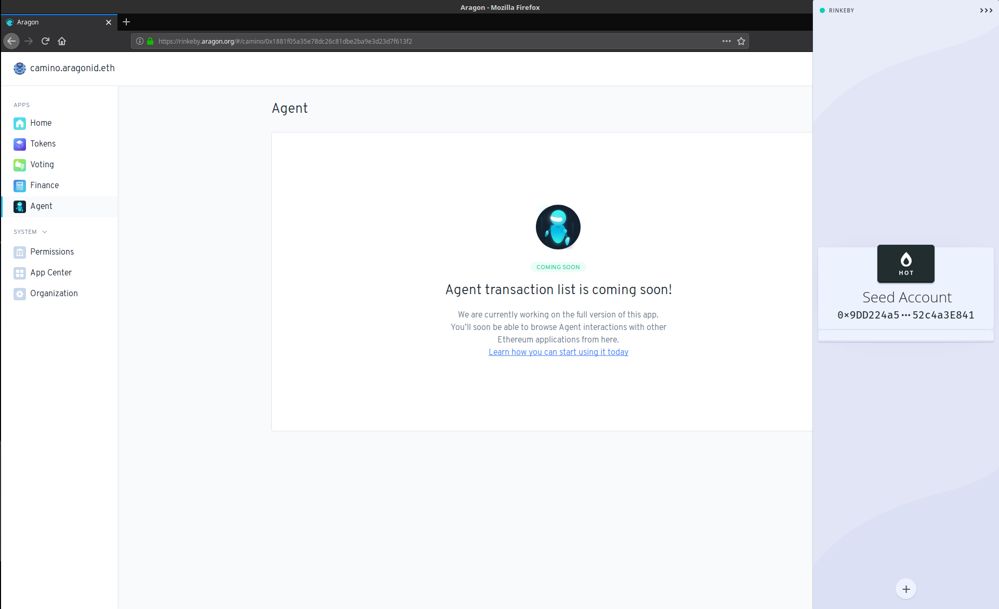

# Agent App

The Agent app enables Aragon organizations to interact directly with any other smart contract on Ethereum. Before Agent, an organization would have to nominate a trusted party to interact with an Ethereum smart contract on its behalf: for example, an organization would send some Dai to one of its employees, who would then be trusted to lend the Dai on Compound, earn interest, and then send the interest plus the principle back to the organization. Now with Agent, an organization can (for example) lend its Dai out on Compound directly, without having to trust any intermediaries.

The easiest way to start using the Agent app is to check the box to optionally install it when first creating your organization:

Note that installing Agent via one of the templates will replace the Vault app normally included with templates that do not use the Agent app.

If you did not optionally install the Agent app when first creating your organization, you can still install it after the organization has been created. To do so, you will need to follow the instructions for [installing and initializing the Agent app using the aragonCLI](https://hack.aragon.org/docs/guides-use-agent). Note that this option is geared towards experts, and we hope to make installing Aragon apps from the frontend possible in the near future.

Once you have the Agent app installed, the fun can begin.

## <mark style="color:purple;">**3.8.1 Agent frontend interface**</mark>

The Agent app currently has a view-only frontend interface that you can use to see which tokens are currently held by the Agent app (including ERC-20, ERC-677, and ERC-777 tokens) as well as see a history of transactions made using the Agent app. The transaction history can be filtered by transaction type, token, or date, and can be exported as a CSV file.

## <mark style="color:purple;">**3.8.2 Using Agent with Frame**</mark>

The easiest way to use the Agent app to interact directly with other Ethereum smart contracts is using the "smart account" feature of Frame. Frame is a desktop-native Ethereum provider with native support for the Agent app. If you already have Frame installed and an "acting account" added, you can skip ahead to section **3.8.2.4 Add your Aragon Agent**.

### **3.8.2.1 Send ETH (or test ETH) to your acting account**

Before you get started, prepare by sending ETH (or test ETH) to your acting account. Your acting account is the account that holds at least one (or partial, if it is divisible) voting token in your organization, and is the account you will use to interact with smart contracts via Agent. The ETH you send to this account is used to pay for gas whenever the Agent app is interacting with other smart contracts. Be sure to top off the ETH in your acting account whenever it's running low so that you don't experience out-of-gas errors when interacting with other smart contracts.

### **3.8.2.2 Install Frame**

Go to the [Frame website](https://frame.sh) and install the Frame desktop client and browser extension.

### **3.8.2.3 Add your acting account**

Open the Frame desktop app and click the "plus-sign" button to add your acting account. You can add it using a hardware wallet or a hot wallet. It is recommended that you use a hardware wallet but in this example we will use a hot wallet since we are using the Rinkeby testnet and not real money on the Ethereum mainnet.

### **3.8.2.4 Add your Aragon Agent**

Go to the same screen on Frame you used to add your acting account, then add your Aragon Agent under the "Smart accounts" section.

Enter the name of your Aragon organization, then click "Next".

Then select the acting account, choosing the account with the address that holds your organization's voting token(s) if you have more than one account to select from:

Select the acting address, choosing the address that holds your organization's voting token(s):

Your Aragon Agent will now show up in the list of available accounts to use with Frame:

### **3.8.2.5 Using your Aragon Agent**

Click on the Aragon logo to use your Agent account. Enter your password if you are using a hot account. You are now ready to interact with any other Ethereum smart contract directly with your Aragon Agent.

Remember that depending on the permissions set in your organization, your organization's tokenholders may need to visit the Voting app and vote on each transaction made using the Agent app.

