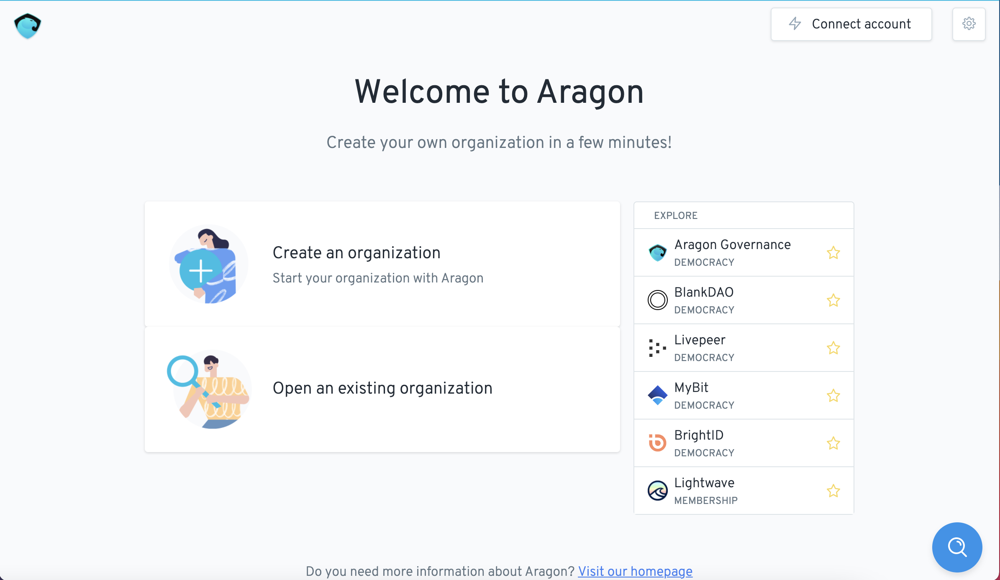

# How to create a DAO on Harmony


&#x20;In this section, we will walk you through how to deploy a DAO using the Aragon Client on the Harmony network.&#x20;


[In 2021 Harmony paired with Aragon to deliver a DAO product using the client.aragon.org interface](https://blog.aragon.org/aragon-client-deployed-on-harmony/)

In this article, we will walk you through how to deploy DAOs on the Harmony test network.&#x20;

### <mark style="color:blue;">Introduction</mark>

[Harmony.one](https://www.harmony.one) is an L2 Ethereum compatible blockchain network with broad compatibility, low costs, and [high transaction rates (allegedly up to 10M/sec)](https://medium.com/@aervinaervin/harmony-10million-transactions-per-second-e8161b7b7f61). It is an 'Effective Proof of Stake' network, where users can transact with each other for fraction of the Mainnet transaction costs. Assets on Ethereum can be moved to Harmony and back again using [bridges](https://docs.harmony.one/home/general/horizon-bridge/bridging-eth-one). By reducing the cost of deploying a DAO from $500+ to a few cents Aragon hopes to inspire hundreds of businesses and non-profits to enter into the Web3 economy.

#### Getting your feet wet with the Harmony Testnet

Connect your Web3 wallet to the Harmony Testnet and deposit "test-ONE". How? [Here](../set-up-metamask/getting-started-with-harmony-testnet.md) is a good guide.&#x20;

#### Getting Started with Harmony for real!

Connect your Web3 wallet to the Harmony network and deposit at least 0.2 ONE. How? [Here](../set-up-metamask/getting-started-with-harmony.md) is a good guide.&#x20;

#### Deploying a DAO

1. **Go to the** [**Aragon Client**](https://client.aragon.org/#/) **page.**

1.  Click "Connect account" and select your wallet provider. In the example below, we have connected our MetaMask account to the Harmony network. If the dialogue box says that it is connected to another network, switch your wallet to the Harmony network. The connected network is automatically derived from the network selected on the wallet

2. **Click "Create an Organization" and follow** [**this tutorial**](how-to-create-a-dao-using-aragon-client/) **that will run you through the creation process.**

