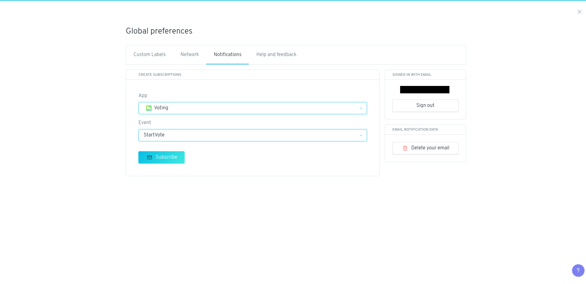
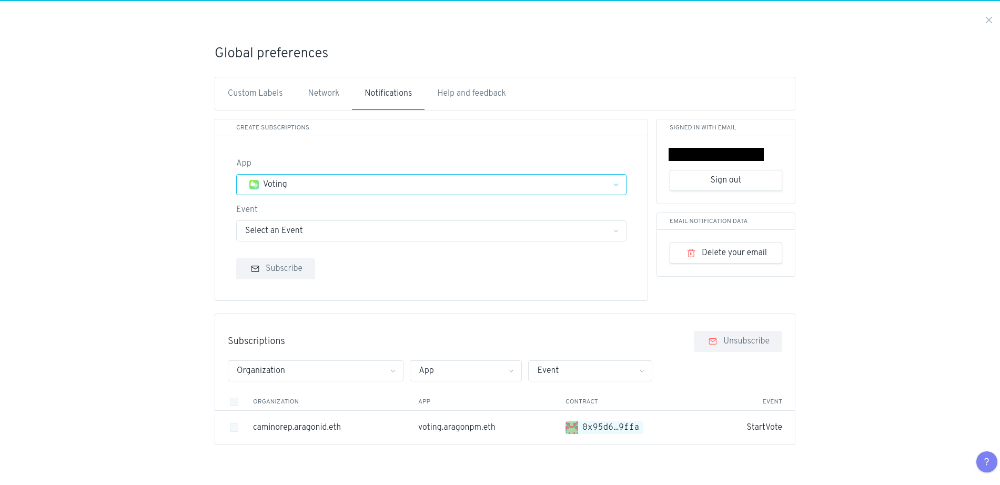

# Home


In this section, we explore the Home page of your DAO, the menu and the main section.


The **Home page** welcomes you to your organization and offers you several options for different actions you can take.&#x20;

The Home page is a simple landing page that shows you:

* the **name of the organization** (on the top left) you have created and loaded,&#x20;
* the **wallet address** and the **network** in use (on the top right),
* as well as different actions that you can take using the **pre-installed apps** in your organization.&#x20;

You can also use the menu on the left-hand side of the screen to view the different **apps** that are currently installed for your organization.&#x20;

In the example (shown in the image), the organization _camino.aragonid.eth_ has the **Token Manager, Voting, Finance**, and **Agent** apps installed, plus default **Permissions, App Center**, and **Organization** System apps.&#x20;

So in this DAO we can perform the actions of assign _Tokens_, _Vote_, _Check Finance_, and _New Payment_.

### <mark style="color:blue;">1. Menu features</mark>

In the menu on the top and left side of the screen, there are several features that you may find useful.&#x20;

Note that many of these features take advantage of the "local storage" in your browser, so if you clear your browser data then you may lose this data unless you make a backup.

#### 1.1 Network connection indicator

The network connection indicator (located on the top right) will tell you if the Aragon client you are using is connected to one of the supported networks or not (either Ethereum, Polygon, Harmony, Rinkeby and so on).&#x20;

* If the node your Aragon client is connected to is having any issues then the light will turn red and indicate that the connection has failed.&#x20;
* If the node your Aragon client is connected to is working properly, then the light will turn green and indicate that the client is successfully connected to the network.

#### 1.2 Enable account

To use the Aragon client, you must first allow Aragon to access your Ethereum account. This will allow the Aragon client to send transactions to your Ethereum account for signing and to read information about your Ethereum account, such as the address and token balances. For more info about this read [here](../../set-up-metamask/).

If not already connected, click _Enable account_ and approve the access request in your Ethereum provider to complete the process.

#### 1.3 Favorite organization

You can click on the organization name at the top left of the screen and click the _star_ icon next to it to add the organization to your favorites.&#x20;

Then even if you go to another organization, you can click on the organization name and see your list of favorites that you can easily navigate to.

#### 1.4 Activity status

Click the _alarm bell_ icon (on the right) to see the status of any transactions you have made using Aragon.&#x20;

You can clear the status history by clicking the _Clear history_ button once you have made a transaction.

#### 1. 5 Global preference

Click the _gear_ icon (on the top right) to manage your global preferences. These preferences will be saved locally and used across every Aragon organization you use.

****

### <mark style="color:blue;">**2. Custom labels**</mark>

Click on any Ethereum address throughout the Aragon client to give it a custom label, such as the name of the person or organization that owns the address.&#x20;

Enter the label and save.

These labels will then show up in your global preferences (the _gear_ icon on the top right) under the Custom Labels tab. You can import a list of labels provided by someone else, and also export or any labels you have created.&#x20;

Make sure to export your labels from time to time to ensure you have a backup in case the local storage in your browser where the labels are stored is accidentally or intentionally cleared.

<mark style="color:blue;">****</mark>

### <mark style="color:blue;">**3. Notifications**</mark>

You can opt-in to email notifications about activity in organizations that you are interested in on the Notifications tab of your global preferences.&#x20;

Enter your email address and then click the activation link in your email to sign up. Then you can add "actions" in your organization that you want to get notified about whenever they happen.

### <mark style="color:blue;">**4. App menu**</mark>

On the left side bar are listed all the apps installed on your DAO. For access to an app click on its name. For more info about the apps go [here](what-are-apps/).

### <mark style="color:blue;">**5. System menu**</mark>

On the left side bar click on the _System_ menu to reveal the System settings that come with every Aragon organization template by default:

* Permissions
* App Center
* Organization

For more info go about the settings go [here](https://app.gitbook.com/o/3h8kxj8geKVXgyMnGbYT/s/zhQIP88M8McmSaEGSymT/\~/changes/vX8aOKfWp1bYBMHIkTj7/users/products/aragon-client/system-menu).&#x20;

****
