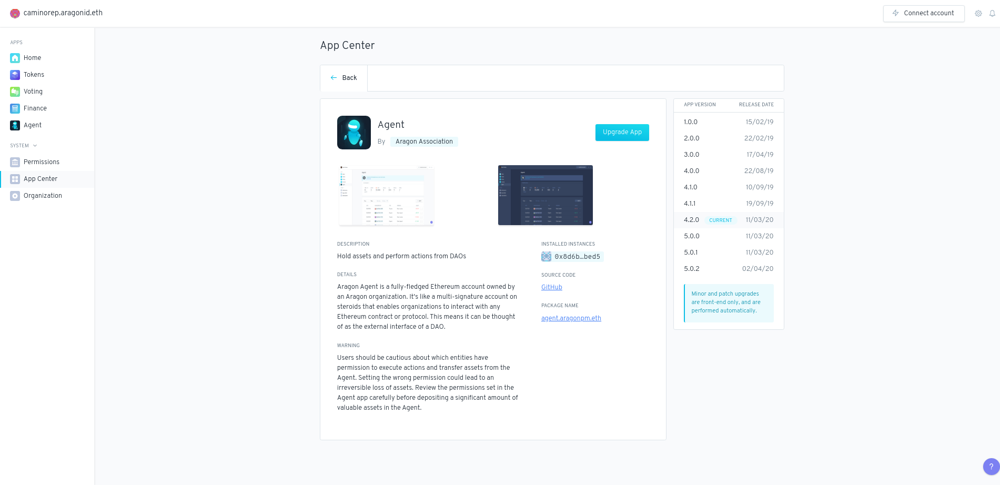

# App Center

The _App Center_ has tabs for upgrading currently-installed apps and browsing apps that are currently in-development.&#x20;

To upgrade an existing app, simply click the _Upgrade app_ button and open a vote to upgrade the app if you do not have direct permission to upgrade the app.

.png>)
