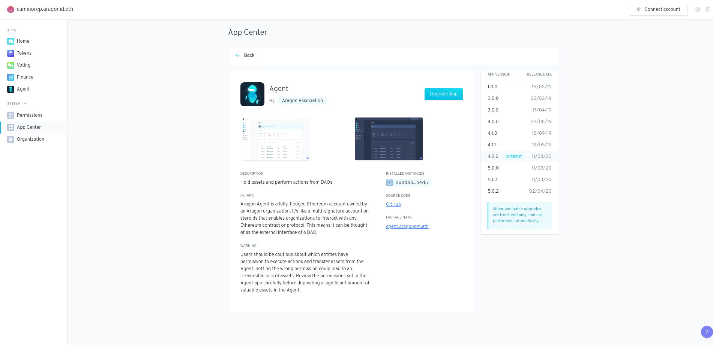

# App Center

The App Center has tabs for upgrading currently-installed apps and browsing apps that are currently in-development. To upgrade an existing app, simply click the "Upgrade app" button and open a vote to upgrade the app if you do not have direct permission to upgrade the app.

.png>)
