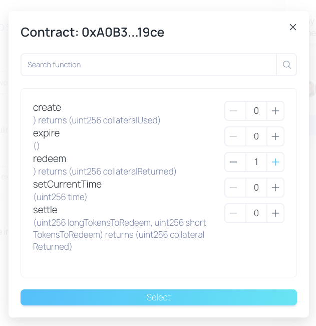

# Aragon Govern migration reward program

If your DAO is eligible for the reward program, please follow these steps to receive your KPI options:

\- Create your new DAO in Aragon Govern - [https://govern.aragon.org](https://govern.aragon.org). This new DAO will receive all the funds from your Aragon Client DAO, so take your time to configure it properly.

\- Go to your new Govern DAO settings, and copy your Govern Executor address.

\- Go back to your Aragon Client DAO, and add \`/govern-migration\` to the end of the URL (e.g.: [https://client.aragon.org/#/aragon/govern-migration](https://client.aragon.org/#/aragon/govern-migration)).

\- You will find the migration page. Fill in the address of your Aragon Govern Executor, and click "Create Proposal".

\- This will create a new proposal to be voted by your DAO, Now is time to get your community to vote to pass the proposal.

\- Once the proposal passes, please get in touch with us through the email \[email protected] so we can execute it for you. But why is this needed?

Aragon Govern enables users to deploy a DAO using proxy contracts (EIP-1167), and 99.9% of the time users will choose this option (since it saves a lot in gas costs). For the migration to happen, the Aragon client DAO will use \`send\` call from Solidity, which has a 2300 gas forwarding limit. Since Aragon Govern uses proxies, 2300 is not enough to make the \`send\` work and it will always fail. The easiest solution available now to overcome this issue is to use Access List Feature (https://eips.ethereum.org/EIPS/eip-2930), but, at this point of time, this feature does not seem to be supported by any Dapp wallet. Because of such limitation, the current solution is to use Access List through \`Ethers.js\` wallet (which runs programmatically). To avoid the trouble of you having to run this code (and paying the gas costs), Aragon will do it for you.&#x20;

Please send us your voting app address and the vote id for the proposal.

\- Once we execute it, we will let you know. At this moment you will be able to consult the options your DAO is entitled in [https://upgrade.aragon.org/governReward](https://upgrade.aragon.org/governReward)

\- Options will be sent to DAOs once a week. Once they are sent, you can look for V2kpi0921 token on your Govern Executor address - The token address is: 0x767b75c2abbeb1f1750903af5cb64bffd754c798.

### Redeeming options - Converting options into ANT 

\- After the execution date of the KPI options (September 30th, 2021) you should schedule a transaction on your Govern DAO, interacting with the KPI option external contract (0xA0B3FD04972c852a806063b40Df9bF05394f19ce), calling the function "redeem" and setting the number of options you want to redeem (in this case, you should set the total amount of options). Once this transaction gets executed, your Govern DAO will hold your new ANT.

