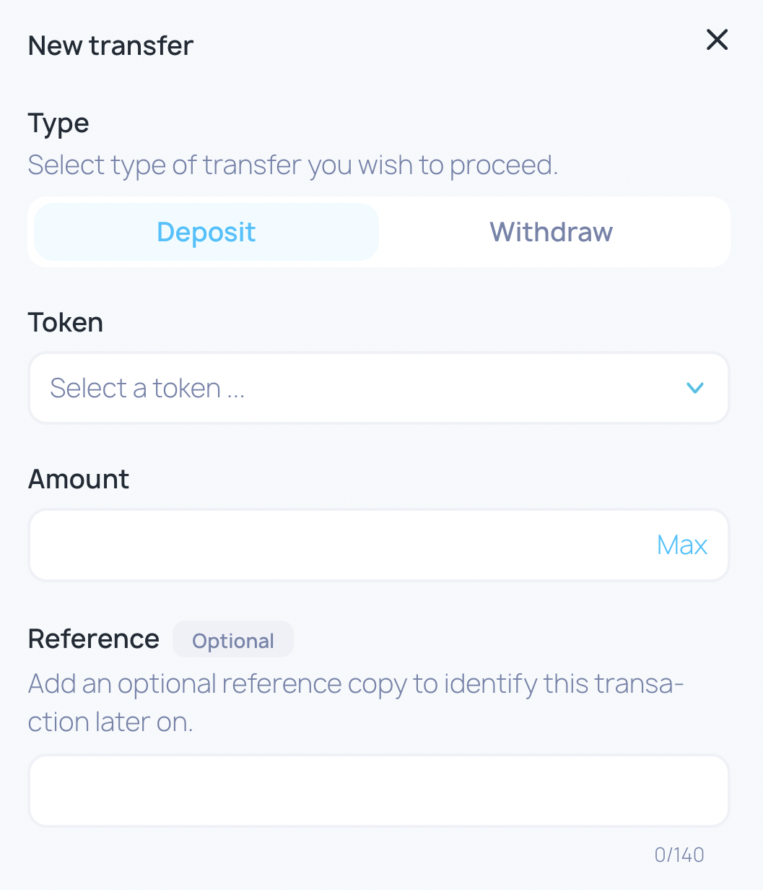

# How to deposit funds

## Depositing Tokens

The token can be deposited on the Govern Finance in the _**Finance**_ section.


Finance - New Transfer - Deposit.&#x20;

**Insert the following fields:**

Token - Select a token from the drop-down menu, the token that will be deposited on Finance. If the token is not listed, click Add other token and paste the smart contract address of your token.

Amount - quantity of token to deposit. The correct format is \<number>.\<number> (ex. 5.0)

Reference (optional) - a text to identify this transa­ction later on.


* Click on the _**Review Deposit**_ button and _**Confirm the Deposit**_.                         

> #### <mark style="color:purple;">Do you have a question? Leave your comments here at our Discourse forum</mark> 👇


